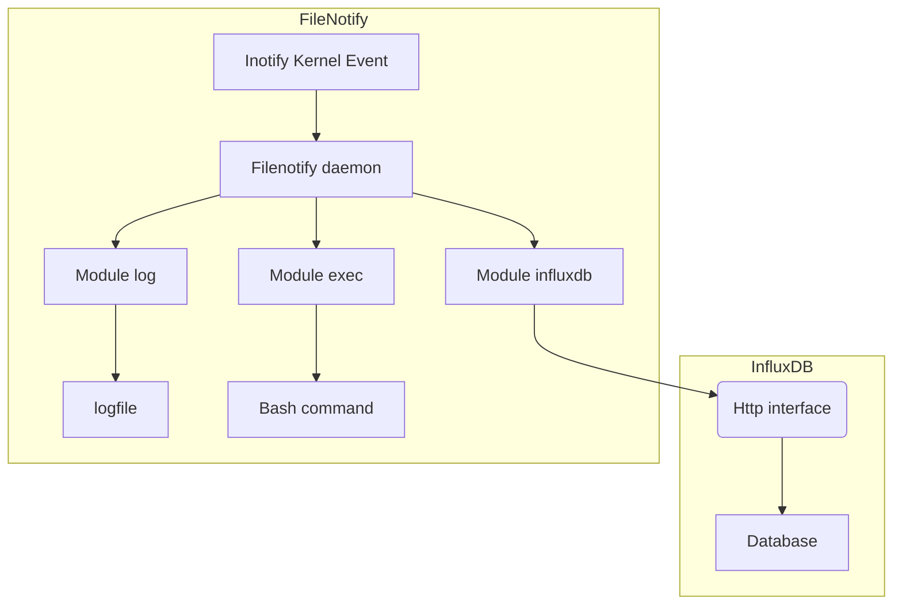

# Filenotify

Filenotify is a binary tools for monitoring filesystem modification and store event in influxdb.

## Donwload

You can download binary from this link : [filenotify.tar.gz](https://framagit.org/matgou/filenotify/-/jobs/artifacts/master/download?job=build)
## Installation

Use Make to build and install the binarny

```bash
make
```

## Usage

```bash
bin/filenotify -c filenotify.config
```

Filenotify will listen kernel's inotify event to do some stuff when file creating or deleting.
He can store event in influxdb database or log it in a logfile. But he can also lauch a shell script.



## Contributing
Pull requests are welcome. For major changes, please open an issue first to discuss what you would like to change.

Please make sure to update tests as appropriate.

## License
[GNU](https://www.gnu.org/licenses/licenses.fr.html)
