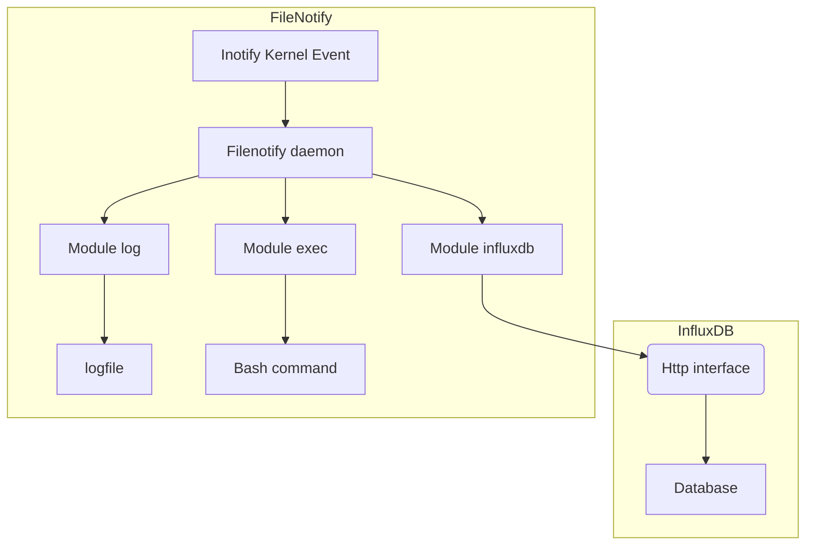

# Filenotify

Filenotify is a binary tools for monitoring filesystem modification and store event in influxdb.


## Donwload

You can download binary from this link : [filenotify.tar.gz](https://framagit.org/matgou/filenotify/-/jobs/artifacts/master/raw/filenotify.tar.gz?job=build)

## Installation

Use Make to build and install the binarny

```bash
make && sudo make install
```
## Exemple of usage 

### Idea 1 : A Influx/Grafana dashboard of file status

With filenotify daemon, you can store file's presence status in influxdb (and time) to build Grafana dashboard. The goal is to visualise file in directory whitout accessing to server, and keep file modification timestamp.


### Idea 2 : A sftp proxy gateway

TODO : Filenotify can watch directory and bounce each receive file to an other server. This is usefull when final server is behind a firewall.

### Idea 3 : A clamav live scan agent

TODO : Filenotify can watch directory and call clamav on each file writing. 

## General usage

```bash
bin/filenotify -c filenotify.config -d
```

Filenotify will listen kernel's inotify event to do some stuff when file creating or deleting.
He can store event in influxdb database or log it in a logfile. But he can also lauch a shell script.



## Contributing
Pull requests are welcome. For major changes, please open an issue first to discuss what you would like to change.

Please make sure to update tests as appropriate.

## License
[GNU](https://www.gnu.org/licenses/licenses.fr.html)
